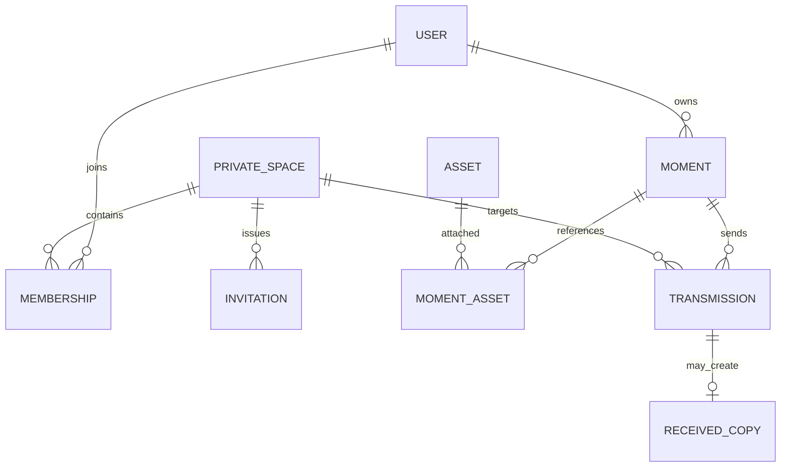
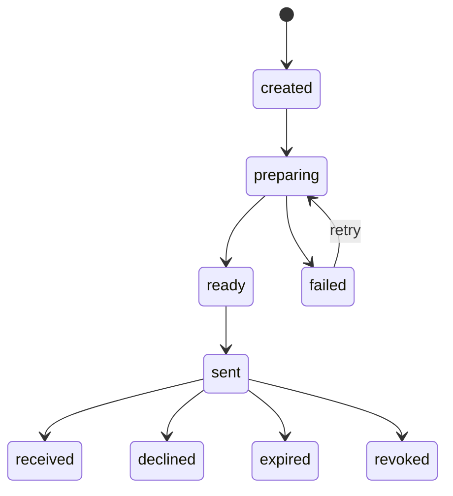

# Lampy 数据模型设计

> 文档状态：V1 事实基线 + 家庭 MVP 候选设计  
> 更新日期：2026-09-22  
> 本文不直接修改领域代码、Repository、存储 Key 或迁移。候选模型需单独评审后才能实施。

## 1. 设计目标

Lampy 的数据模型必须同时支持：

1. 一句话、最多三张图片或一段声音组成一条生活记录；
2. 离线创建、草稿恢复和媒体失败保全；
3. 按发生时间长期回看；
4. 个人与家庭两个清楚的访问边界；
5. 分享、接收和撤销具有独立历史；
6. 老人本人记录与家人协助记录不被混淆；
7. 微信小程序和 iOS 使用不同存储 Adapter，但共享领域事实；
8. 未来扩展时不破坏已有 Moment V1 数据。

## 2. 设计原则

### 2.1 领域事实与展示语言分离

Moment、Asset、Transmission 是领域名称；“记录”“过去”“家里”等展示词可以调整，不反向重命名存储结构。

### 2.2 内容、媒体和传递分离

- Moment 表达一条被确认留下的生活记录。
- Asset 表达独立媒体及其存储状态。
- Transmission 表达一次传递过程。
- Membership 表达用户在私人空间中的资格。
- AccessGrant/Visibility 表达访问范围，不由 UI 布尔值代替。

### 2.3 时间诚实

- `occurredAt`：事情发生时间；
- `recordedAt`：记录进入系统的时间；
- `importedAt`：外部素材进入系统的时间；
- `captureTime`：媒体 metadata 或用户确认的拍摄线索。

这些字段不能相互冒充。

### 2.4 数据保全优先

- 读取失败不等于空数据。
- Asset 缺失不等于 Moment 不存在。
- 分享失败不改变源 Moment。
- 页面失败不覆盖 Repository。
- 非法记录隔离但保留原文。

### 2.5 身份、记录者、内容主体和所有者分离

“谁按下录音”“记录主要关于谁”“谁拥有这份 Moment”“谁能查看”可能是不同的人，不能压缩成一个 `userId`。

## 3. 当前 V1 已确认模型

### 3.1 Moment

当前 Moment 是核心聚合根，主要结构如下：

```ts
type Moment = {
  id: string
  schemaVersion: 1
  revision: number
  ownerId: string
  content: {
    note?: string
    significance?: string
    emotion?: string
  }
  time: {
    occurredAt?: string
    occurredAtPrecision: 'exact' | 'day' | 'month' | 'year' | 'unknown'
    timezone?: string
    recordedAt: string
    importedAt?: string
  }
  assetIds: string[]
  context: {
    people: PersonReference[]
    place?: PlaceReference
    tags: string[]
  }
  origin: CreatedOrigin | ImportedOrigin | ReceivedOrigin
  accessSummary: {
    visibility: string
    futureAccessEnabled: boolean
  }
  lifecycle: {
    status: 'draft' | 'active' | 'archived' | 'trashed'
    activatedAt?: string
    archivedAt?: string
    trashedAt?: string
  }
  audit: {
    createdAt: string
    updatedAt: string
  }
}
```

已确认规则：

- active Moment 至少包含文字、Asset，或合法 received origin；
- revision 从 1 开始，只由领域命令递增；
- Moment 只保存 Asset ID；
- 非 owner 不能修改主体；
- 永久删除不是 lifecycle 状态；
- MVP 不采集 significance，但兼容字段暂时保留；
- 当前 `local-user` 只是未登录阶段过渡身份。

### 3.2 Asset

```ts
type Asset = {
  id: string
  ownerId: string
  type: 'image' | 'video' | 'audio'
  captureTime?: string
  captureTimeSource?: 'metadata' | 'user' | 'system'
  localUri?: string
  storage: {
    status: 'local' | 'pending' | 'ready' | 'failed' | 'missing'
    originalKey?: string
    previewKey?: string
    thumbnailKey?: string
  }
  metadata: {
    mimeType?: string
    sizeBytes?: number
    width?: number
    height?: number
    durationMs?: number
  }
  integrity: { checksum?: string }
  userCaption?: string
  audit: { createdAt: string; updatedAt: string }
}
```

MVP 约束候选：

- 单个 Moment 最多三个 image Asset；
- 单个 Moment 最多一个 audio Asset；
- video 在领域中可识别，但不进入本轮 MVP 创建能力；
- 缓存 URI 不能被视为长期存储；
- 文件丢失只改变 Asset 可用性，不自动改变 Moment lifecycle。

### 3.3 Transmission

```ts
type Transmission = {
  id: string
  sourceMomentId: string
  sourceRevision: number
  senderId: string
  recipientId?: string
  status: 'created' | 'sent' | 'received' | 'declined' | 'expired' | 'revoked'
  message?: string
  createdAt: string
  sentAt?: string
  receivedAt?: string
  legacy?: boolean
  legacySource?: string
}
```

当前 `sent` 只表示本地分享意图，不证明网络送达。真实家庭分享前必须重新定义目标、快照、幂等和失败语义。

## 4. 目标领域关系



这是语义图，不是最终数据库表设计。

## 5. 用户与设备候选模型

### 5.1 User

```ts
type User = {
  id: string
  status: 'active' | 'disabled' | 'deleted'
  displayName: string
  avatarAssetId?: string
  createdAt: string
  updatedAt: string
}
```

原则：

- User 是稳定应用身份，不等同微信 openId 或 Apple user identifier。
- 平台登录身份通过独立 IdentityLink 关联。
- displayName 不是法律姓名。
- 删除账户需通过明确流程，不由本地退出登录触发。

### 5.2 IdentityLink

```ts
type IdentityLink = {
  id: string
  userId: string
  provider: 'wechat' | 'apple' | 'phone' | 'local-migration'
  providerSubject: string
  status: 'active' | 'revoked'
  linkedAt: string
}
```

`providerSubject` 只能由认证服务使用，不进入普通页面 ViewModel。

### 5.3 DeviceRegistration

```ts
type DeviceRegistration = {
  id: string
  userId: string
  platform: 'wechat-mini-program' | 'ios'
  installationId: string
  status: 'active' | 'revoked'
  lastSeenAt: string
}
```

设备注册不赋予内容所有权，只服务安全会话、同步和通知。

## 6. 私人家庭空间候选模型

### 6.1 PrivateSpace

领域建议使用中性名称 `PrivateSpace`，UI 可以称“家里”或后续确认的产品词。

```ts
type PrivateSpace = {
  id: string
  ownerId: string
  displayName: string
  kind: 'family'
  status: 'active' | 'suspended' | 'closed'
  createdAt: string
  updatedAt: string
}
```

`kind: 'family'` 表达产品用途，不证明法律或血缘关系。

### 6.2 Membership

```ts
type Membership = {
  id: string
  spaceId: string
  userId: string
  role: 'owner' | 'admin' | 'member'
  status: 'invited' | 'active' | 'left' | 'removed'
  joinedAt?: string
  endedAt?: string
  invitedByUserId?: string
  revision: number
  createdAt: string
  updatedAt: string
}
```

不变量候选：

- 同一 user + space 同时只能有一个 active Membership；
- owner 不能在未移交所有权时直接退出；
- admin 不能读取成员的 Personal Moment；
- left/removed 后不能访问新的家庭内容；
- 退出后的历史副本规则由 Transmission 快照语义决定。

### 6.3 Invitation

```ts
type Invitation = {
  id: string
  spaceId: string
  inviterId: string
  tokenHash: string
  status: 'active' | 'accepted' | 'expired' | 'revoked'
  maxUses: number
  useCount: number
  expiresAt: string
  createdAt: string
  acceptedAt?: string
  acceptedByUserId?: string
}
```

原则：

- 服务端只保存 token hash；
- 邀请不可猜测、有时效、可撤销；
- 加入需要接受者明确确认；
- 不通过身份证或户口证明家庭关系；
- 接受操作幂等。

## 7. Moment 所有权与协助记录

当前 `ownerId` 表示这份 Moment 副本的主人，应继续保留。

为支持家人协助老人记录，候选增加聚合外或 context 内的明确事实：

```ts
type Contribution = {
  id: string
  momentId: string
  contributorUserId: string
  role: 'recorder' | 'importer' | 'editor-assistant'
  declaredSubjectPersonId?: string
  consentBasis?: 'self' | 'assisted-with-consent' | 'legacy-unknown'
  createdAt: string
}
```

说明：

- `contributorUserId` 是执行记录的人；
- `declaredSubjectPersonId` 是用户声明的内容主体，不代表平台认证身份；
- `ownerId` 仍是 Moment 副本主人；
- `consentBasis` 不应被当成法律证明，只用于产品透明度；
- 是否把 Contribution 作为独立实体，需要在真实交互流程确认后决定。

MVP 不应仅为展示一句“由家人代录”就立即改变 Moment schema。先通过 Projection 需求验证，再决定持久化边界。

## 8. 可见性与访问候选

### 8.1 VisibilityPolicy

```ts
type VisibilityPolicy =
  | { mode: 'personal' }
  | { mode: 'family'; spaceId: string }
```

约束：

- 默认 personal；
- 加入家庭不自动共享历史；
- 修改默认值不追溯旧 Moment；
- 页面显示的 `accessSummary` 只是 Projection/摘要，不是完整授权账本。

### 8.2 AccessGrant

如果采用共享引用而非接收副本，需要独立授权实体：

```ts
type AccessGrant = {
  id: string
  resourceType: 'moment'
  resourceId: string
  granteeType: 'user' | 'space'
  granteeId: string
  permission: 'view'
  status: 'active' | 'revoked' | 'expired'
  grantedByUserId: string
  grantedAt: string
  revokedAt?: string
  expiresAt?: string
  revision: number
}
```

当前需要在“共享引用”和“接收副本”之间做正式决策，不应同时含糊实现。

## 9. Transmission V2 候选

### 9.1 目标

真实 Transmission 必须回答：

- 谁发起；
- 发送哪条 Moment 的哪个 revision；
- 发给一个用户还是一个家庭空间；
- 内容安全是否通过；
- 是否真正提交、可见、收到或失败；
- 重试是否仍是同一次逻辑发送；
- 源内容修改后，接收内容是否变化。

### 9.2 候选结构

```ts
type TransmissionV2 = {
  id: string
  idempotencyKey: string
  sourceMomentId: string
  sourceRevision: number
  senderId: string
  target:
    | { type: 'user'; userId: string }
    | { type: 'space'; spaceId: string }
  snapshot: {
    version: 1
    contentHash: string
    assetIds: string[]
  }
  moderation: {
    status: 'not-required' | 'pending' | 'approved' | 'rejected' | 'error'
    checkedAt?: string
  }
  status:
    | 'created'
    | 'preparing'
    | 'ready'
    | 'sent'
    | 'received'
    | 'declined'
    | 'failed'
    | 'expired'
    | 'revoked'
  failure?: {
    code: string
    retryable: boolean
  }
  createdAt: string
  updatedAt: string
  sentAt?: string
  receivedAt?: string
  revokedAt?: string
}
```

### 9.3 候选状态机



禁止：

- `created` 直接声称 `received`；
- moderation rejected 后对家庭可见；
- 网络超时直接标记 sent；
- 删除源 Moment 来表达撤回；
- 使用 `isPassed` 替代状态机。

## 10. 接收语义决策

有两种可行模型，必须二选一形成 ADR。

### 方案 A：接收副本

收到后生成接收者自己的 Moment：

- ownerId 为接收者；
- origin.type 为 received；
- 保存 transmissionId、originalMomentId、snapshotRevision；
- 发送者后续修改不改变接收副本。

优点：长期稳定、离线清晰、符合当前 V1。  
风险：家庭空间多人副本增多；撤回语义复杂。

### 方案 B：共享引用

Moment 保持发送者所有，家庭成员通过 AccessGrant 查看。

优点：单一来源、撤销直接。  
风险：源被修改或删除会改变他人历史；离线和长期保存更复杂。

当前模型更接近方案 A。MVP 推荐继续采用版本绑定的接收副本，但在实现前必须明确：空间群发如何生成副本、成员退出如何处理、撤回能否删除已接收副本。

## 11. 情绪数据候选

MVP 不应把 emotion 设计成分数或诊断结果。

候选结构：

```ts
type EmotionContext = {
  kind: 'selected' | 'self-described' | 'uncertain'
  value?: string
}
```

迁移策略：现有 `content.emotion?: string` 继续读取；只有在产品语言和交互验证后才考虑 schema 升级。不得为了候选结构提前迁移。

## 12. 本地草稿与文件模型

### 12.1 Draft

```ts
type MomentDraft = {
  id: string
  ownerId: string
  baseMomentId?: string
  note: string
  emotion?: string
  occurredAt?: string
  occurredAtPrecision: string
  assetIds: string[]
  state: 'editing' | 'persisting-assets' | 'recoverable-failure'
  createdAt: string
  updatedAt: string
}
```

### 12.2 文件持久化

Asset 文件状态和上传状态不应混成一个布尔值。iOS 候选需要至少表达：

```ts
type LocalFileState =
  | { status: 'temporary'; uri: string }
  | { status: 'persisting'; sourceUri: string }
  | { status: 'persisted'; uri: string }
  | { status: 'missing'; expectedUri?: string }
```

保存顺序：生成 Asset ID → 持久化文件 → 校验 → 保存 Asset → 挂接 Moment → 激活 Moment → 清除草稿。

失败时必须能够从已完成阶段继续，不能重新创建另一条 Moment。

## 13. Projection/ViewModel 边界

建议新增而不是让页面读取领域对象：

- `RecentLifeProjection`
- `CreateMomentViewModel`
- `HistoryYearProjection`
- `HistoryMonthProjection`
- `HistoryDayProjection`
- `MomentDetailViewModel`
- `FamilySpaceProjection`
- `FamilyInvitationViewModel`
- `TransmissionStatusViewModel`

ViewModel 可以包含展示文案和布局提示，但不得暴露：

- 原始 provider identity；
- 存储 Key；
- invitation token hash；
- Repository 内部状态；
- 不必要的 ownerId、revision 和 schemaVersion；
- 对媒体内容的未经确认推断。

## 14. Repository 候选

```ts
interface UserRepository {}
interface IdentityLinkRepository {}
interface PrivateSpaceRepository {}
interface MembershipRepository {}
interface InvitationRepository {}
interface MomentRepository {}
interface AssetRepository {}
interface TransmissionRepository {}
interface AccessGrantRepository {}
interface DraftRepository {}
interface AssetFileStore {}
```

所有 Repository 必须具备：

- 运行时校验；
- 明确 not-found；
- 写入幂等或 revision/CAS 约束；
- 不覆盖未知原始记录；
- 稳定错误码；
- 平台 Adapter 与领域接口分离。

## 15. SQLite/服务端映射建议

iOS 本地建议表：

- `moments`
- `assets`
- `moment_assets`
- `drafts`
- `draft_assets`
- `transmissions`
- `sync_operations`
- `schema_migrations`

服务端家庭能力候选表：

- `users`
- `identity_links`
- `private_spaces`
- `memberships`
- `invitations`
- `moments`
- `assets`
- `moment_assets`
- `transmissions`
- `received_copies` 或 `access_grants`
- `moderation_cases`
- `audit_events`

这是概念映射，不是授权 Cursor 立即建表。

## 16. 数据安全与日志

- 媒体文件不进入普通应用日志。
- 邀请 token、签名 URL 和认证 subject 不进入错误上报正文。
- 内容安全结果只保存必要状态和供应方引用，不复制不必要的敏感内容。
- 删除、撤回、移除成员和权限变化应产生审计事件。
- 客户端本地数据库损坏时不得用空库覆盖云端或原始文件。
- 云端同步必须以 operation/idempotency key 表达，不依赖页面是否仍打开。

## 17. 迁移策略

1. 保持 Moment V1、Asset V1、Transmission V1 和现有 Key 可读。
2. 家庭模型使用新版本和新 Repository，不复用 legacy nearby 数据假装真实关系。
3. 当前本地 pass Transmission 继续标记 legacy/local intent。
4. 新模型先双读或通过 Projection 兼容，不能先删除旧数据。
5. 任一迁移单条失败进入 quarantine，其他合法数据继续。
6. schema 升级必须具备 source fingerprint、幂等和重复运行测试。

## 18. 实施前必须决定

1. 接收副本还是共享引用。
2. 家庭空间群发是每成员一条 Transmission，还是一条 Transmission 加接收明细。
3. 成员退出后既有接收副本是否保留。
4. 撤回对已接收副本的作用。
5. 家人协助记录的 Contribution 是否进入 MVP。
6. emotion 是否需要 schema V2。
7. 微信和 iOS 如何绑定同一 User。
8. 本地优先同步的冲突策略。
9. 云端媒体加密、密钥和备份策略。
10. 账号删除与家庭数据保留规则。

## 19. Definition of Done

家庭数据模型只有在以下条件满足后才可进入实现：

- 核心名词和所有权没有歧义；
- 邀请、加入、退出、移除状态机完整；
- Transmission 快照和失败幂等明确；
- 个人内容不会因加入家庭自动公开；
- 老人协助记录不会冒充本人；
- UGC 审核失败不会删除个人原始内容；
- 所有破坏性场景有审计和恢复规则；
- 微信和 iOS Adapter 不侵入领域实体；
- 迁移、损坏集合和重复请求测试齐全。

