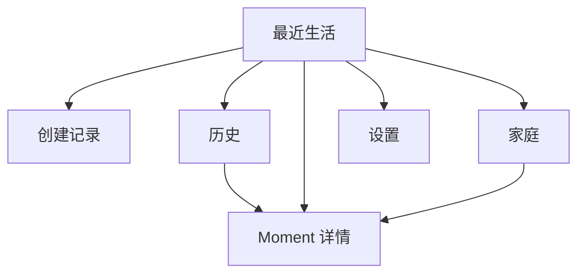

# Lampy UI、UX 与用户 Journey 设计

> 文档状态：MVP 体验基线，低保真方向  
> 更新日期：2026-09-22  
> 本文定义行为、信息结构和状态。高保真视觉与最终产品语言仍需单独确认。

## 1. 体验目标

Lampy 的体验目标不是让用户“完成一次内容发布”，而是：

> 用最少的准备留下真实生活，并在未来自然回到当时。

用户应感受到：

- 这里不要求表演；
- 内容很普通也可以成立；
- 保存过程可靠；
- 时间会形成结构；
- 分享给家庭是一次清楚、有边界的交付；
- 产品不会催促、评价或放大情绪。

## 2. 体验设计原则

### 2.1 页面从生活行为开始

每个页面先回答它承载的行为：

| 页面 | 主要生活行为 |
|---|---|
| Splash | 从系统启动平稳进入今天 |
| 首页 | 看见最近生活留下了什么 |
| 创建 | 随手写、拍或说一点 |
| 历史 | 感知生活随时间积累 |
| 详情 | 重新进入当时的一小段生活 |
| 家庭 | 进入一个有限、可信的共同空间 |

### 2.2 信息结构不依赖 Card

去掉所有圆角容器后，页面仍应依靠以下关系成立：

- 日期层级；
- 内容比例；
- 图片本身；
- 文字行长与留白；
- 声音的时长和播放状态；
- 记录间真实的时间距离；
- 进入和返回的位置连续性。

### 2.3 不规则来自内容和时间

- 横图、竖图和方图保留差异；
- 同一天多条自然组合；
- 记录少时允许更多留白；
- 记录多时通过层级和窗口控制密度；
- 不使用随机旋转、随机位置或随机延迟制造生活感。

### 2.4 可靠性可被感知

用户需要知道：

- 内容是否仍在；
- 是否已经保存；
- 分享是否真的发出；
- 媒体缺失是否只影响局部；
- 返回或中断后是否能继续。

反馈小而明确，不使用长动画代替状态。

## 3. 反模板检查

每个页面评审必须回答：

1. 是否仍由多个圆角 Card 组成？
2. 是否只是换成暖色模板？
3. 是否仍像表单、信息流或后台系统？
4. 是否过度依赖输入框、Tabs 和悬浮按钮？
5. 是否所有内容拥有相同尺寸和节奏？
6. 是否通过装饰而非结构制造生活感？
7. 是否换 Logo 后可直接用于任何日记产品？
8. 是否让普通生活显得不够值得记录？
9. 是否制造连续记录或积极情绪压力？
10. 是否尊重原始照片、声音和文字？
11. 是否适合五年后继续浏览？
12. 是否能在微信小程序和 iOS 可靠实现？

前三项任一为“是”，该方案不能作为最终方向。

## 4. 信息架构

### 4.1 MVP 一级结构



家庭能力未实现前，不显示可产生误解的空壳入口。

### 4.2 导航原则

- 首页、历史是长期主入口；创建从首页自然进入。
- 不以悬浮按钮作为唯一创建入口。
- 家庭不是公开动态 Tab。
- 设置承载账号、隐私、权限、数据管理和开发诊断，不占首页注意力。
- 详情通过 Moment ID 精确打开。

底部导航是否采用系统 Tab Bar，需要在高保真阶段结合页面结构验证；本文件不预设标准 Tabs 是唯一答案。

## 5. Splash → 首页

### 5.1 目标

Splash 应像首页尚未完全展开的状态，而不是盖在首页上的另一张海报。

稳定层：

- 页面底色；
- 安全区；
- 日期或时间位置；
- 首页主要布局占位。

过渡层：

- Lampy 品牌；
- 首次简短说明；
- 内容列的轻微显现。

### 5.2 状态

```text
initial → brand-visible → revealing-home → home-ready
```

- 首次启动：可出现品牌和一句说明；
- 普通冷启动：仅短品牌过渡；
- 返回前台/页面返回：不重播；
- 触摸跳过：幂等地收敛到 home-ready；
- Reduce Motion：直接 home-ready 或极短淡入；
- 加载失败：进入首页 error，不回 Splash。

### 5.3 验收

- Splash 退出后日期不跳位；
- 不出现夜空到暖色背景闪烁；
- 不锁住整个首页超过必要时间；
- 动画被中断后页面可操作；
- Splash 状态不进入领域存储。

## 6. 首页：最近生活

### 6.1 页面行为

帮助用户看见最近生活留下了什么，并自然继续记录；不承担完整历史和公开信息流职责。

### 6.2 首屏层级

1. 今天/当前日期，作为时间锚点；
2. 最近一至数日的真实内容；
3. 自然的记录入口；
4. 进入历史和家庭的次级路径。

品牌标题、统计数字和导航不应压过内容。

### 6.3 内容组织

- 以自然日分组，但日期不做标签胶囊。
- 一条文字可直接存在于页面留白中。
- 图片按原始方向占据有意义的版面，不统一裁切。
- 音频以时间长度、简洁进度和“听见当时”的入口存在。
- 同一天多条可以形成组，但每条仍有可点击边界和读屏顺序。
- 页面不使用随机光点墙。

### 6.4 数量状态

#### 首次使用

- 真实空页面；
- 一句直接说明；
- 写、拍、录的统一入口；
- 不生成示例生活冒充用户内容。

#### 只有一条

- 让这条内容成为页面主体；
- 不用大面积装饰填满空间。

#### 同一天多条

- 共享一次日期；
- 通过内容形态和自然间距形成节奏；
- 不复制同尺寸容器。

#### 连续多天

- 日期形成纵向时间骨架；
- 日与日的间距可以大于同日记录间距。

#### 很久未记录

- 最近内容仍然保留；
- 不显示中断天数；
- 入口保持自然可见。

#### 一年后

- 首页只展示有限最近窗口；
- 完整积累交给历史；
- 不无限追加 Feed。

### 6.5 状态

- `loading`：稳定骨架，无假内容；
- `ready`：真实最近内容；
- `empty`：首次空状态；
- `error`：说明暂时无法读取并允许重试；
- 读取失败绝不能被投影成 empty。

## 7. 创建记录

### 7.1 页面行为

让文字、照片和声音自然组成同一段生活记录，而不是让用户填写一张表。

### 7.2 空白状态

- 页面主体是一块可直接开始留下内容的空间；
- 光标可以自然出现，但不使用显眼字段边框和“内容”标签；
- 拍照、选图、录音作为贴近内容的动作，而不是九宫格功能菜单；
- 保存动作在存在有效内容后明确出现。

### 7.3 文字

- 不显示传统多行输入框边框；
- 保持舒适行长和足够光标对比；
- 键盘出现时媒体和保存仍可到达；
- 超大字号时页面滚动而不是压缩字体。

### 7.4 图片

- 最多三张；
- 选择后在正文空间自然排布；
- 单图尽量保留原始比例；
- 两图可形成主次或并置；
- 三图结构由方向和比例决定，不随机；
- 删除入口明确但视觉克制；
- 处理/持久化中有局部状态。

### 7.5 声音

状态：

```text
idle → requesting-permission → recording → recorded → playing/paused
```

- 点击开始、点击停止；
- 录制中显示时长和明确停止动作；
- 结束后可试听、删除或重录；
- 不自动播放；
- 波形如使用，只表达真实或确定性采样数据，不做装饰性随机动画；
- 权限拒绝不影响文字和图片。

### 7.6 草稿

- 文字、媒体变动后自动保存；
- 离开时不弹出阻塞式“是否保存”作为唯一保全；
- 再次进入时提示继续；
- 放弃草稿需要明确确认；
- 说明内容是否还在。

### 7.7 保存反馈

- 保存时不播放长动画；
- 成功反馈简短，如“保存好了”；
- 可以通过内容轻微归位表达“被留下”；
- 失败明确说明内容仍在并提供重试；
- 重复点击不生成重复 Moment。

## 8. 历史浏览

### 8.1 页面行为

不是查数据库，而是感知生活在时间中的疏密，并从年自然进入月、日和 Moment。

### 8.2 年

- 年份是主要时间坐标；
- 12 个月通过真实记录密度形成纹理；
- 空月保留空间，但不出现警告；
- 不把记录数量做成竞赛式年度总结；
- 点击或聚焦某月进入月视图。

### 8.3 月

- 让用户感知哪些日子留下过内容；
- 不等同于标准日历打卡热力图；
- 日期强弱来自是否有记录和内容形态，不表示好坏；
- 从月进入日后返回保持月份位置。

### 8.4 日

- 展开当天文字、图片和声音的自然组合；
- 日期只出现一次；
- 同日记录按发生时间及确定性回退排序；
- 时间未知内容使用诚实的回退说明。

### 8.5 导航连续性

```text
年位置 → 月位置 → 日位置 → Moment 详情
   ↑         ↑         ↑            |
   └──────── 返回时恢复原上下文 ─────┘
```

需要保存：

- 当前 year/month/day；
- 滚动位置或焦点项；
- 从哪个 Moment 进入；
- 返回后的视觉锚点。

## 9. Moment 详情

### 9.1 页面行为

让用户重新进入当时的一小段生活，而不是阅读一张数据详情卡。

### 9.2 内容顺序

建议基础顺序：

1. 发生时间或诚实的记录时间回退；
2. 主要文字/主要图片，根据内容主导关系调整；
3. 其余图片；
4. 声音；
5. 情绪语境；
6. 来源与家庭范围等低权重信息。

不是每条都必须占满所有区域。不存在的部分直接消失，不保留空字段。

### 9.3 图片

- 单图尊重方向与比例；
- 两图和三图形成可预测组合；
- 点击进入沉浸预览；
- 缺失时在原位置显示克制说明；
- 不用统一圆角框包裹所有图。

### 9.4 声音

- 必需能力：播放、暂停、时长、错误；
- 控件像“听听当时”，而不是音频剪辑工具栏；
- 播放状态有视觉和读屏反馈；
- 页面离开、切换和播放结束正确释放；
- 不自动播放。

### 9.5 状态

- loading：稳定时间与内容骨架；
- ready：精确 Moment；
- not-found：不回退其他记录；
- error：允许重试，不覆盖数据；
- partial：某个 Asset 不可用但其他内容正常。

## 10. 家庭空间

> 只有在家庭领域模型和真实后端完成后才上线。

### 10.1 页面行为

看见家庭成员明确交到这里的生活，而不是家庭社交 Feed。

### 10.2 结构

- 空间名称和成员入口低权重存在；
- 最近收到/共享的内容按时间组织；
- 不显示在线状态、阅读人数、点赞和评论；
- 不根据互动排序；
- 明确区分“我的个人记录”和“交给家里的记录”。

### 10.3 邀请

- 创建者生成有时效邀请；
- 接受者看到邀请人、空间和权限说明；
- 加入需要明确确认；
- 不要求证明亲属关系；
- 不自动公开个人历史。

### 10.4 分享

- 从一条 active Moment 发起；
- 显示目标空间和共享结果；
- `preparing`、`sent`、`failed` 不混淆；
- 内容安全检查失败不删除个人 Moment；
- 无真实回执时不显示“家人已收到”。

## 11. 核心 User Journeys

### Journey A：第一次留下文字

**目标**：在一分钟内理解并完成第一条记录。

```text
首次 Splash
→ 真实空首页
→ 点击“留下今天”
→ 直接写一句话
→ 保存
→ 回到首页看见刚刚的内容
→ 可打开详情
```

关键体验：

- 不先注册；如业务必须登录，应推迟到跨设备/家庭需要时；
- 不先选择记录类型；
- 不要求情绪和 significance；
- 保存后内容位置明确；
- 返回首页不是庆祝页。

失败恢复：写入失败保留草稿，允许重试。

### Journey B：只录一段声音

```text
首页
→ 创建
→ 点击“录一段声音”
→ 按需请求麦克风权限
→ 点击开始
→ 点击停止
→ 试听
→ 保存
→ 首页出现声音记录
→ 详情重新播放
```

关键体验：

- 权限说明具体；
- 老年用户不依赖长按；
- 录音状态清楚；
- 杀死 App 后仍能恢复已保存声音；
- 中断不静默丢文件。

### Journey C：文字加三张照片

```text
创建
→ 写一句话
→ 选择照片
→ 系统照片选择器
→ 选择 3 张
→ 回到创建页自然排布
→ 调整/删除其中一张
→ 保存
→ 详情按确定顺序展示
```

第四张处理：在选择或返回后立即说明最多三张，不静默遗漏。

### Journey D：恢复草稿

```text
创建并输入内容
→ 切后台/退出/进程结束
→ 再次进入创建
→ 看见草稿内容摘要
→ 继续同一草稿
→ 保存为一条 Moment
```

关键体验：不生成第二个 ID；放弃需确认；失败说明内容仍在。

### Journey E：从一年回到某一天

```text
首页
→ 历史
→ 年视图感知月份疏密
→ 进入某月
→ 进入某日
→ 打开 Moment
→ 返回后仍在原日位置
```

关键体验：不是 Tab + 列表；空白时间不责备；返回连续。

### Journey F：家庭邀请，功能上线后

```text
家庭入口
→ 创建私人空间
→ 生成限时邀请
→ 家人打开邀请
→ 看见邀请人和权限说明
→ 主动确认加入
→ 进入空家庭空间
```

关键体验：不验证血缘；不自动共享历史；邀请可撤销。

### Journey G：把一条记录交给家人

```text
Moment 详情
→ 选择交给家里
→ 确认目标空间
→ 内容安全检查/准备
→ 真实发送成功
→ 状态显示已发送
```

失败：保持源 Moment，显示未发出并允许幂等重试。

### Journey H：老人自己录音

```text
大字号首页
→ 明确的“录一段声音”
→ 点击开始
→ 大号状态与时长
→ 点击停止
→ 听一遍
→ 保存
→ 明确反馈“保存好了”
```

关键体验：无需理解图标；不使用长按；取消和重试清楚；不谈纪念或身后。

### Journey I：家人协助老人记录

```text
家人开始记录
→ 说明由谁执行记录
→ 获得本人同意
→ 录音/拍照/导入
→ 保存到明确所有者或空间
→ 详情显示来源，不冒充本人创建
```

该 Journey 需要数据模型决策后才可实现。

## 12. 全局状态矩阵

| 场景 | 页面反应 | 数据反应 |
|---|---|---|
| 首次空库 | 自然空状态 | 不写 mock |
| 读取失败 | error + 重试 | 不写空集合 |
| 保存失败 | 内容仍在 + 重试 | 保留草稿与文件 |
| 图片缺失 | 局部说明 | 不删除 Moment |
| 音频失败 | 局部错误 | 不写回永久缺失，除非可靠确认 |
| Moment 不存在 | not-found | 不回退其他记录 |
| 权限拒绝 | 继续可用能力 | 不清空草稿 |
| 网络断开 | 个人保存继续 | 分享排队或失败可重试 |
| 家庭审核失败 | 不进入家庭可见 | 个人 Moment 保留 |
| 成员退出 | 明确结果 | 按 Membership/快照规则收敛 |

## 13. 响应式设计

### 手机竖屏

- 单列内容优先；
- 保存和媒体动作避开键盘、安全区；
- 图片不超出可读宽度。

### 手机横屏

- 避免把单列文字拉满屏；
- 可使用时间栏 + 内容区；
- 旋转不重建草稿和音频状态。

### iPad/平板

- 首页可使用稳定时间栏与较宽内容舞台；
- 历史可让年/月上下文和日内容同时存在；
- 详情控制正文行长；
- 不简单把手机 UI 等比放大；
- 支持 Split View 的窄宽变化。

### 超大字号

- 信息改为纵向重排；
- 关键操作使用文字；
- 底部操作不被键盘遮挡；
- 截断只允许非关键辅助文本；
- 时间、保存、开始/停止录音保持完整。

## 14. 无障碍

- 关键触控目标满足平台建议最小尺寸；
- 对比度符合 WCAG/平台要求；
- 不只用颜色表达状态；
- VoiceOver 顺序与视觉阅读顺序一致；
- 图片预览、播放、暂停、缺失状态有语义标签；
- 动态状态通过 live region/平台等价能力通知，但不频繁打扰；
- 尊重 Reduce Motion；
- 不禁止系统字体缩放；
- 权限与错误文案使用具体动作。

## 15. 动效规格基线

| 动效 | 触发 | 时长 | 建议缓动 | 范围 | 可取消/降级 | 触摸影响 |
|---|---|---:|---|---|---|---|
| Splash 退出 | 冷启动准备完成 | 180–320ms | ease-out | opacity 1→0，位移不超过 8pt | Reduce Motion 直接完成 | 不应长期拦截 |
| 新记录归位 | 保存成功 | 220–360ms | ease-out | opacity 0→1，位移 6–12pt | 直接显示 | 不阻止返回 |
| 日期展开 | 年/月进入下一级 | 240–400ms | ease-in-out | 位置连续，缩放不超过 4% | 简单淡入 | 转场中可取消 |
| 详情出现 | 打开 Moment | 180–300ms | ease-out | 图片/文字轻微进入注意力 | 直接呈现 | 内容尽早可滚动 |
| 音频状态 | 播放/暂停 | 120–200ms | linear/ease | 真实进度变化 | 静态图标 + 时间 | 不影响暂停 |

禁止无限漂浮、随机动画、大面积粒子、持续模糊和为了等待动画而延迟保存。

## 16. UI Token 方向

本阶段只定义原则，不锁定最终数值：

- 色彩：暖中性底色，小范围低饱和强调；不把每条内容染成不同卡片色。
- 字体：优先系统字体，保证中文、数字时间与超大字号质量。
- 行长：正文保持舒适阅读宽度，平板不无限延长。
- 圆角：只服务图片裁切、按钮触控或系统控件，不作为所有信息默认容器。
- 阴影：极少使用，不用阴影模拟“生活感”。
- 留白：时间层级和内容呼吸的主要工具。
- 图标：配合文字，不承担老人核心操作的唯一解释。

完整 Design Tokens 在视觉方向确认后另立规格。

## 17. 页面反模板验收

### 首页

- 不是 Card Feed；
- 日期不是标签；
- 真实空库可见；
- 一条和大量内容都成立；
- 没有随机光墙。

### 创建

- 不是字段表单；
- 不先选模板；
- 文字、图片、声音可独立开始；
- 权限拒绝不阻断其他能力；
- 草稿可靠恢复。

### 历史

- 不是日/月/年 Tabs + 同一列表；
- 年、月、日结构真实不同；
- 空白时间不被惩罚；
- 返回保持时间位置。

### 详情

- 不是数据 Card 堆叠；
- 不存在的字段不留空框；
- 媒体失败局部化；
- 声音不像工具栏；
- 时间来源诚实。

### 家庭

- 不是群聊或动态 Feed；
- 没有互动热度；
- 权限与发送状态准确；
- 不暗示验证亲属关系。

## 18. 测试与验证

### 自动化

- Projection 在相同输入下确定；
- Moment ID 精确导航；
- 草稿恢复；
- 三图限制；
- 保存幂等；
- 时间边界；
- 缺失媒体；
- 页面状态互斥；
- 返回位置恢复状态序列。

### 微信开发者工具/真机

- 小屏、常规屏、横屏；
- 超大字号；
- Splash 跳过与切后台；
- 相册/麦克风拒绝；
- 音频切换与释放；
- 无、单、多 Moment；
- 损坏集合与迁移后启动；
- 无闪白、无日期跳位。

### iPhone/iPad 真机

- 相机、有限相册、麦克风；
- 来电/后台音频中断；
- 杀进程后草稿与媒体恢复；
- VoiceOver；
- Reduce Motion；
- Dynamic Type 最大字号；
- 横竖屏、iPad Split View；
- 磁盘不足和文件缺失；
- 低性能设备掉帧与触摸响应。

## 19. 进入高保真前的决策门

以下事项未确认前，不应绘制家庭功能最终高保真：

1. 产品语言最终方向；
2. 家庭空间的展示名称；
3. 接收副本或共享引用；
4. 成员退出和撤回规则；
5. 情绪输入方式；
6. 首页最近窗口和历史导航结构；
7. iOS 与微信是否共享账号；
8. Design Tokens 与主视觉方向；
9. 内容安全处理中的等待和失败语义；
10. 老人协助记录的所有权与来源表达。

